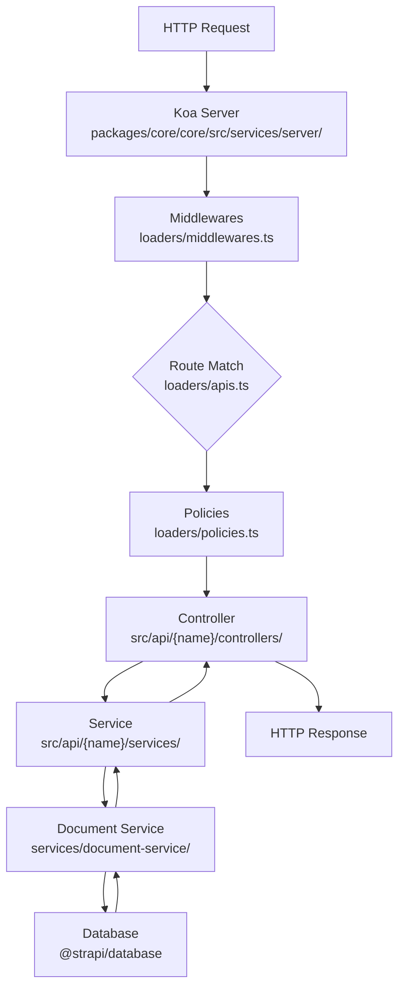

# Strapi Architecture Guide for New Contributors

> Read time: ~15 minutes. Every code claim cites a file that was actually opened.

---

## 1. Strapi in One Paragraph

Strapi is an open-source headless CMS (Node ≥20, Yarn 4) that exposes content via a
REST/GraphQL API and manages it through a React 18 admin dashboard. The repository is a
**Yarn workspaces + Nx monorepo** with packages grouped under `packages/core/` (framework),
`packages/plugins/` (official plugins), `packages/providers/` (email/upload adapters),
`packages/utils/` (shared tooling), `packages/cli/` (scaffolding tools), `examples/` (dev
sandboxes, not for production fixes), and `tests/` (integration, E2E, CLI). The central
runtime object is the **`Strapi` class** — a lazy DI container that wires every subsystem
together and is always injected as a parameter; never accessed via `global.strapi` in
application code. The primary target branch is `develop`, not `main`.

_Sources: [`AGENTS.md`](../target/strapi/AGENTS.md), [`package.json`](../target/strapi/package.json)_

---

## 2. Package Map

| Package                            | Path                                 | Responsibility                                                                        | Who Should Care                              |
| ---------------------------------- | ------------------------------------ | ------------------------------------------------------------------------------------- | -------------------------------------------- |
| `@strapi/strapi`                   | `packages/core/strapi`               | Public entry point — re-exports `@strapi/core` + `@strapi/types`                      | Everyone; this is what user apps `require()` |
| `@strapi/core`                     | `packages/core/core`                 | `Strapi` class, DI container, loaders, all internal services                          | Backend / plugin devs                        |
| `@strapi/admin`                    | `packages/core/admin`                | React 18 admin dashboard (Vite, React Router, Redux)                                  | Admin frontend devs                          |
| `@strapi/database`                 | `packages/core/database`             | DB abstraction (Knex) — MySQL, PostgreSQL, MariaDB, SQLite; migrations; query builder | Backend / DB devs                            |
| `@strapi/content-manager`          | `packages/core/content-manager`      | Content management UI + server logic; dual entry points                               | Plugin devs, admin devs                      |
| `@strapi/types`                    | `packages/core/types`                | Shared TypeScript type definitions; single source of truth                            | Everyone writing TypeScript                  |
| `@strapi/permissions`              | `packages/core/permissions`          | RBAC engine                                                                           | Backend / plugin devs needing access control |
| `@strapi/plugin-users-permissions` | `packages/plugins/users-permissions` | JWT authentication + user management plugin                                           | Backend / auth plugin devs                   |

_Sources: [`AGENTS.md` package table](../target/strapi/AGENTS.md), [`packages/core/strapi/src/index.ts`](../target/strapi/packages/core/strapi/src/index.ts)_

---

## 3. Request Lifecycle

```
Routes → Policies → Middlewares → Controllers → Services → Document Service → Database
```

| Layer                | Real location                                                                                  | What it does                                                                             |
| -------------------- | ---------------------------------------------------------------------------------------------- | ---------------------------------------------------------------------------------------- |
| **Routes**           | `packages/core/core/src/loaders/apis.ts` (loaded); defined per-API in `src/api/<name>/routes/` | Declares URL patterns and maps them to controllers                                       |
| **Middlewares**      | `packages/core/core/src/loaders/middlewares.ts`; `packages/core/core/src/services/server/`     | Koa middleware stack — auth, body parsing, error handling, CORS                          |
| **Policies**         | `packages/core/core/src/loaders/policies.ts`                                                   | Gate execution before the controller (RBAC checks, custom guards)                        |
| **Controllers**      | Loaded via `packages/core/core/src/loaders/apis.ts`; live in `src/api/<name>/controllers/`     | Handle HTTP request/response; call services; should not contain business logic           |
| **Services**         | `packages/core/core/src/services/` (internal); `src/api/<name>/services/` (user-land)          | Business logic layer; orchestrate Document Service calls                                 |
| **Document Service** | `packages/core/core/src/services/document-service/`                                            | High-level content CRUD API (`strapi.documents`); handles i18n, draft/publish, relations |
| **Database**         | `packages/database/`                                                                           | Knex-based query builder; accessed via `strapi.db`; never bypass for content ops         |

### Flowchart



_Sources: [`packages/core/core/src/loaders/`](../target/strapi/packages/core/core/src/loaders), [`packages/core/core/src/services/`](../target/strapi/packages/core/core/src/services)_

---

## 4. App Lifecycle

`start()` calls `load()` internally, which runs `register()` then `bootstrap()`. Every
phase runs in three layers: **providers** (internal), then **plugins**, then the **user**
`src/index.ts` lifecycles.

| Phase         | What happens                                                                                                                                                                                                                                                        | Where in code                                                                                                                                          |
| ------------- | ------------------------------------------------------------------------------------------------------------------------------------------------------------------------------------------------------------------------------------------------------------------- | ------------------------------------------------------------------------------------------------------------------------------------------------------ |
| **Register**  | EE license init; each provider calls `.register()`; plugins register routes/controllers/services/content-types; user `register()` hook runs; custom field types resolved                                                                                            | [`Strapi.register()`](../target/strapi/packages/core/core/src/Strapi.ts#430)                                                                           |
| **Bootstrap** | DB models transformed and `db.init()` called; schema synced (`db.schema.sync()`); middlewares initialised (`server.initMiddlewares()`); routing wired (`server.initRouting()`); content API permissions registered; plugins bootstrap; user `bootstrap()` hook runs | [`Strapi.bootstrap()`](../target/strapi/packages/core/core/src/Strapi.ts#447)                                                                          |
| **Start**     | `load()` completes (`isLoaded = true`); server begins listening on configured host/port or socket; startup telemetry sent; admin browser auto-opened in development                                                                                                 | [`Strapi.start()`](../target/strapi/packages/core/core/src/Strapi.ts#259) / [`Strapi.listen()`](../target/strapi/packages/core/core/src/Strapi.ts#376) |
| **Destroy**   | Plugin destroy lifecycles run; providers destroyed; user `destroy()` hook runs; server closed; event hub destroyed; DB connections closed; `global.strapi` deleted                                                                                                  | [`Strapi.destroy()`](../target/strapi/packages/core/core/src/Strapi.ts#553)                                                                            |

> **Important:** `strapi.isLoaded` is `false` during Register. Plugins and the DB are
> not available until after `load()` completes (i.e., after Bootstrap).
> _Source: [`AGENTS.md`](../target/strapi/AGENTS.md)_

---

## 5. Server vs Admin Split

Packages that have **both** a Node.js backend and a React UI export two separate entry
points declared in their `package.json` `exports` field:

| Entry point     | Purpose                                                               | Runtime      |
| --------------- | --------------------------------------------------------------------- | ------------ |
| `strapi-server` | Registers routes, controllers, services, content types, middleware    | Node.js only |
| `strapi-admin`  | Exports React components, hooks, translations for the admin dashboard | Browser only |

**Concrete example — `@strapi/content-manager`** (`packages/core/content-manager`):
its `strapi-server` export registers the Content Manager REST API and document service
hooks; its `strapi-admin` export provides the React pages and components that render
inside `@strapi/admin`.

The top-level entry point `@strapi/strapi` (`packages/core/strapi/src/index.ts`) is
server-only: it simply re-exports everything from `@strapi/core` plus `@strapi/types`.
The admin dashboard has its own root package `@strapi/admin`.

_Sources: [`AGENTS.md` — Server/Admin split](../target/strapi/AGENTS.md), [`packages/core/strapi/src/index.ts`](../target/strapi/packages/core/strapi/src/index.ts)_

---

## 6. Five Things New Contributors Get Wrong

### 1. Using `global.strapi` instead of DI

`global.strapi` is set internally and deleted on [`destroy()`](../target/strapi/packages/core/core/src/Strapi.ts#572) (`delete global.strapi`). In
your own code — services, controllers, lifecycles — always accept `strapi` as a parameter
(e.g. `createService({ strapi })`). The global exists for legacy compatibility; new code
must not rely on it.
_Source: [`AGENTS.md`](../target/strapi/AGENTS.md), [`Strapi.ts:572`](../target/strapi/packages/core/core/src/Strapi.ts#553)_

### 2. Using Entity Service instead of Document Service

Entity Service (`strapi.entityService`) is **deprecated**. The `entityService` getter still
exists on the `Strapi` class (line 115) for backwards compatibility, but all new content
operations must use **Document Service** (`strapi.documents`), backed by
`packages/core/core/src/services/document-service/`. The legacy `services/entity-service/`
folder still exists — do not add new logic there.
_Source: [`AGENTS.md`](../target/strapi/AGENTS.md), [`Strapi.ts`](../target/strapi/packages/core/core/src/Strapi.ts#115)_

### 3. Targeting the wrong branch

All pull requests must branch from **`develop`** and target **`develop`**. The `main`
branch is the stable release branch — PRs to `main` will be rejected.
_Source: [`AGENTS.md` — PR Guidelines](../target/strapi/AGENTS.md)_

### 4. Touching EE-gated code without understanding the CE/EE split

Some features are Enterprise Edition only, guarded at runtime by `this.EE` (see
[`Strapi.ts:499`](../target/strapi/packages/core/core/src/Strapi.ts#499): `if (this.EE) { await utils.ee.checkLicense(...) }`).
Directories named `ee/` (e.g. `packages/core/core/src/ee/`,
`packages/core/admin/ee/`) carry a different license and must never be bypassed. Run
`IS_EE=true yarn test:front` to exercise EE paths in frontend tests.
_Source: [`AGENTS.md`](../target/strapi/AGENTS.md), [`Strapi.ts:499`](../target/strapi/packages/core/core/src/Strapi.ts#447)_

### 5. Accessing services before `isLoaded` is true

The DI container ([`container.ts`](../target/strapi/packages/core/core/src/container.ts)) resolves services lazily — a resolver function is
called once on first `get()` and then cached. However, plugins and the database are not
registered until the Register phase and not available until Bootstrap sets `isLoaded =
true` ([`Strapi.load():425`](../target/strapi/packages/core/core/src/Strapi.ts#421)). Calling `strapi.documents` or `strapi.db` before that point
will either throw or return an uninitialised instance.
_Source: [`AGENTS.md`](../target/strapi/AGENTS.md), [`Strapi.load()`](../target/strapi/packages/core/core/src/Strapi.ts#421), [`container.ts`](../target/strapi/packages/core/core/src/container.ts)_
