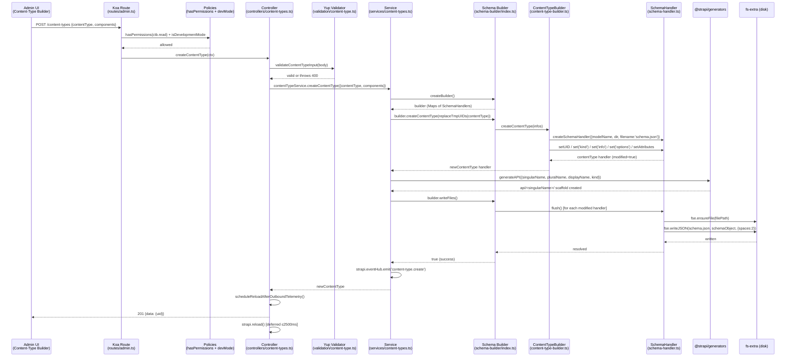

# End-to-End Trace: Creating a Content Type

> Feature: submitting a new content type via the **Content-Type Builder** admin UI.
> Every claim cites a file that was actually opened. Uncertain items are marked **UNVERIFIED:**.

---

## Numbered Call Chain

### Step 1 — Route definition
**File:** `target/strapi/packages/core/content-type-builder/server/src/routes/admin.ts` · lines 45–58

A single `POST /content-types` route entry maps to the handler `content-types.createContentType`.
It is protected by two guards applied in order:
1. `admin::hasPermissions` with `actions: ['plugin::content-type-builder.read']` — confirms the
   admin user holds the CTB read permission (the only permission level the CTB uses).
2. `isDevelopmentMode` middleware — ensures the endpoint is unreachable in production, preventing
   accidental schema mutations at runtime.

---

### Step 2 — Controller: `createContentType`
**File:** `target/strapi/packages/core/content-type-builder/server/src/controllers/content-types.ts` · lines 81–124

`async createContentType(ctx)` is the Koa route handler. It:
1. Reads `ctx.request.body` (destructures into `body.contentType` and `body.components`).
2. Calls `validateContentTypeInput(body)` (a Yup schema validator — see Step 2a). Returns
   `400` with the validation error object if that throws.
3. Sets `strapi.reload.isWatching = false` to suppress the file-watcher from triggering a
   reload mid-write.
4. Resolves the `content-types` service via `getService('content-types')` and calls
   `contentTypeService.createContentType({ contentType: body.contentType, components: body.components })`.
5. Fires a telemetry event (`didCreateFirstContentType` or `didCreateContentType`) and
   schedules `strapi.reload()` via `scheduleReloadAfterOutboundTelemetry` (max 2 500 ms wait so
   a stuck telemetry client cannot block the server restart indefinitely).
6. Returns `{ data: { uid: contentType.uid } }` with HTTP 201.

---

### Step 2a — Input validation
**File:** `target/strapi/packages/core/content-type-builder/server/src/controllers/validation/content-type.ts` · lines 119–121

`validateContentTypeInput` builds a Yup schema via `createContentTypeSchema(data)` and
runs `validateYupSchema(...)` against the full request body. This is where required fields
(`singularName`, `pluralName`, `displayName`, `kind`) and attribute type constraints are
checked before any mutation occurs.

---

### Step 3 — Service: `createContentType`
**File:** `target/strapi/packages/core/content-type-builder/server/src/services/content-types.ts` · lines 125–201

`export const createContentType = async ({ contentType, components }, options)` is the
orchestration layer. It:
1. Calls `createBuilder()` to obtain a fresh schema-builder instance (loads the current
   in-memory content types and components from `strapi.contentTypes` and `strapi.components`).
2. Calls `builder.createNewComponentUIDMap(components)` to generate stable UIDs for any
   inline components whose UIDs are still temporary (`__temp_key__` strings).
3. Runs `replaceTemporaryUIDs(uidMap)` over the incoming payload to substitute all temp UIDs
   with real ones.
4. Calls `builder.createContentType(replaceTmpUIDs(contentType))` — this builds the in-memory
   schema handler (Step 4).
5. For each supplied component, calls `builder.createComponent(options)` (new) or
   `builder.editComponent(options)` (existing), targeting the new content type's UID.
6. If `contentType.plugin` is absent (i.e. an app-level type), calls `generateAPI(...)` which
   invokes `@strapi/generators` to scaffold the `api/<singularName>/` folder skeleton
   (controller stub, router, service, and an empty `schema.json`). This happens **before**
   writing the schema so that a failure in `generateAPI` can be cleanly rolled back.
7. Calls `builder.writeFiles()` — serialises all modified schema handlers to disk (Step 6).
   If `writeFiles()` returns `false`, rolls back via `rollbackSchemaMutation` and throws.
8. Emits `content-type.create` on `strapi.eventHub` (line 198) and returns the new
   content-type handler.

---

### Step 4 — Schema builder: `createContentType` (in-memory)
**File:** `target/strapi/packages/core/content-type-builder/server/src/services/schema-builder/content-type-builder.ts` · lines 146–193

`createContentType(infos)` builds the in-memory representation of the new type. It:
1. Derives (or validates) the UID via `createContentTypeUID` → `api::<singularName>.<singularName>`
   (or `plugin::<plugin>.<singularName>` for plugin-owned types).
2. Throws `contentType.alreadyExists` if the UID is already registered.
3. Computes the target directory:
   - app-level: `strapi.dirs.app.api/<singularName>/content-types/<singularName>`
   - plugin-level: `strapi.dirs.app.extensions/<plugin>/content-types/<singularName>`
4. Constructs a new `createSchemaHandler({ modelName, dir, filename: 'schema.json' })` and
   registers it in `tmpContentTypes` (the builder's working map).
5. Chains `.setUID()`, `.set('kind', ...)`, `.set('collectionName', ...)`, `.set('info', ...)`,
   `.set('options', ...)`, `.set('pluginOptions', ...)`, `.set('config', ...)` to populate the
   schema state — each `set` call flips the handler's `modified` flag.
6. Calls `createContentTypeAttributes(uid, infos.attributes)` which converts API-shape attributes
   to internal schema shape (`convertAttributes`), wires bidirectional relation inverses via
   `setRelation`, and handles self-referencing `__self__` placeholders.

---

### Step 5 — Schema builder: initialisation (`createBuilder`)
**File:** `target/strapi/packages/core/content-type-builder/server/src/services/schema-builder/index.ts` · lines 12–54 (factory), 61–187 (builder object)

`createBuilder()` snapshots every live content type and component from `strapi.contentTypes`
and `strapi.components` into a `Map<uid, SchemaHandler>`. This gives the builder a writable
working copy that mirrors the on-disk state. The two Maps (`tmpComponents`, `tmpContentTypes`)
accumulate all pending mutations until `writeFiles()` is called.

`writeFiles()` (lines 153–174) collects every `SchemaHandler` from both Maps and calls
`schema.flush()` on each in parallel via `Promise.all`. If any flush fails, `rollback()` is
called on every handler before returning `false`.

---

### Step 6 — Schema handler: `flush` → disk write
**File:** `target/strapi/packages/core/content-type-builder/server/src/services/schema-builder/schema-handler.ts` · lines 33–58 (initialisation), 244–289 (flush)

`createSchemaHandler(infos)` holds two copies of the schema state: `initialState` (frozen,
used for rollback) and `state` (mutable working copy). The `modified` flag is set whenever any
`set*` method is called.

`async flush()` (line 244) is the function that writes to disk:
1. Returns immediately if `this.writable` is false (i.e. the handler is admin-owned).
2. Computes `filePath = path.join(state.dir, state.filename)` — typically
   `src/api/<singularName>/content-types/<singularName>/schema.json`.
3. If `deleted`, removes the file via `fse.remove(initialPath)`.
4. If `modified`, calls `fse.ensureFile(filePath)` to create parent directories, then
   **`fse.writeJSON(filePath, { kind, collectionName, info, options, pluginOptions, attributes, config, indexes, foreignKeys }, { spaces: 2 })`** (lines 265–279).
   This is the actual disk write — `fs-extra`'s `writeJSON` serialises the schema object as
   pretty-printed JSON.
5. If the file path changed (rename), removes the old file and prunes empty directories.

**`fse.writeJSON` at line 265 is the moment the `schema.json` file lands on disk.**

---

## Mermaid Sequence Diagram



---

## Where Would I Change X?

### Add a custom validation rule before a content type is created (e.g. block certain `singularName` values)
**File:** `target/strapi/packages/core/content-type-builder/server/src/controllers/validation/content-type.ts` · around line 119 inside `validateContentTypeInput`.

`createContentTypeSchema(data)` returns the Yup shape. Add a `.test(...)` or extra `.string()` constraint
to the `singularName` field in that Yup schema. No other file needs touching — the result is thrown
back to the controller as a 400 before any mutation begins.

Alternatively, for a cross-cutting validation that also fires on programmatic calls (not just the
HTTP endpoint), add the check at the top of `createContentType` in
`target/strapi/packages/core/content-type-builder/server/src/services/content-types.ts` · line 128,
before `builder.createContentType(...)` is called.

### Change how the `schema.json` file is formatted or where it is written
**File:** `target/strapi/packages/core/content-type-builder/server/src/services/schema-builder/schema-handler.ts` · lines 265–279 (`flush`).

The `fse.writeJSON` call at line 265 controls the file path (`filePath`), the serialised fields
(`kind`, `collectionName`, `info`, `options`, `pluginOptions`, `attributes`, `config`, `indexes`,
`foreignKeys`), and the formatting options (`{ spaces: 2 }`). Change `spaces` to alter indentation,
add/remove top-level keys to adjust what is persisted, or swap `fse.writeJSON` for a custom writer
to use a different format altogether.

The output path is computed on line 250 (`path.join(state.dir, state.filename)`); `state.dir` is
set in `createContentType` (content-type-builder.ts line 160) and `state.filename` is always
`'schema.json'` (line 166). Change either of those to redirect where the file lands.

### Run custom logic after a content type is created (e.g. seed initial data, notify a webhook)
**File:** `target/strapi/packages/core/content-type-builder/server/src/services/content-types.ts` · line 198.

`strapi.eventHub.emit('content-type.create', { contentType: newContentType })` fires here after
every successful creation. Subscribe to it in your plugin or `src/index.ts` bootstrap:
```ts
strapi.eventHub.on('content-type.create', ({ contentType }) => {
  // your logic — contentType.uid, contentType.schema, etc. are available
});
```
No core files need to be modified.

---

## Time Saved

A new developer manually grepping through this plugin for the create-content-type call chain
would typically take **3–6 hours**; reading this document takes **10–15 minutes**.
