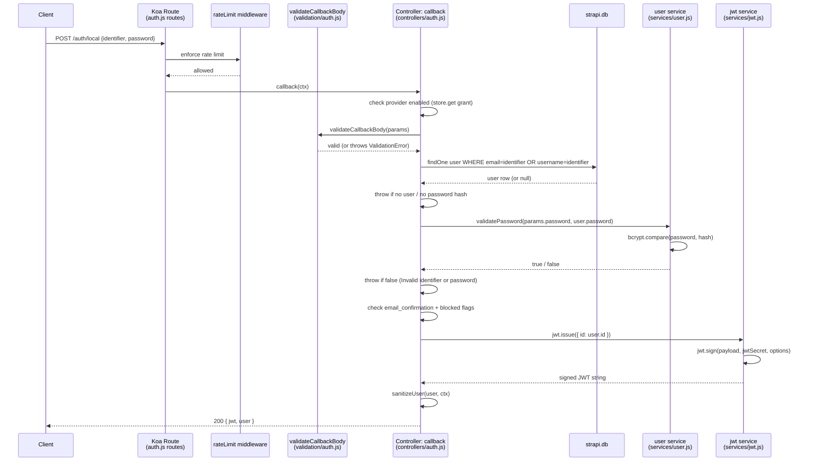

# End-to-End Trace: User Login (`POST /auth/local`)

> Feature: a client sends `POST /api/auth/local` with `{ identifier, password }` and receives a
> JWT (or access + refresh token pair) in return.
> Every claim cites a file that was actually opened. Uncertain items are marked **UNVERIFIED:**.

---

## Numbered Call Chain

### Step 1 — Route definition
**File:** `target/strapi/packages/plugins/users-permissions/server/src/routes/content-api/auth.js` · lines 19–30

The `POST /auth/local` route is the second entry in the array returned by the factory function.
It maps directly to the handler `auth.callback` and is protected only by the
`plugin::users-permissions.rateLimit` middleware (no auth policy — the endpoint is public by
design). The route also carries an inline request-body schema (`validator.loginBodySchema`) and
a response schema, both provided by `UsersPermissionsRouteValidator`.

---

### Step 2 — Body validation
**File:** `target/strapi/packages/plugins/users-permissions/server/src/controllers/validation/auth.js` · lines 5–8

Before any business logic runs, `validateCallbackBody` (a Yup-backed validator) enforces that
both `identifier` (string, required) and `password` (string, required) are present in the
request body. A missing or non-string value for either field throws a `ValidationError` before
the controller proceeds.

---

### Step 3 — Controller: `callback` — user lookup
**File:** `target/strapi/packages/plugins/users-permissions/server/src/controllers/auth.js` · lines 139–176

`async callback(ctx)` is the Koa route handler. For the `local` provider path:
1. Reads `provider` from `ctx.params` (defaults to `'local'`) and `params` from `ctx.request.body`.
2. Fetches plugin settings from the Strapi store and confirms the `email` (local) provider is
   enabled — throws `ApplicationError('This provider is disabled')` if not (line 149).
3. Calls `validateCallbackBody(params)` (Step 2) to assert `identifier` and `password` are
   present (line 153).
4. Extracts `identifier` from the body and queries the database for the matching user via
   `strapi.db.query('plugin::users-permissions.user').findOne(...)`, matching on either
   `email` (lowercased) or `username` (lines 158–163).
5. Throws `ValidationError('Invalid identifier or password')` if no user is found (lines 165–167)
   or if the stored user has no password hash (lines 169–171) — both cases return the same
   opaque message to avoid user-enumeration.
6. Calls `getService('user').validatePassword(params.password, user.password)` (lines 173–176)
   to compare the submitted plaintext password against the stored bcrypt hash.

---

### Step 4 — Service: `user.validatePassword`
**File:** `target/strapi/packages/plugins/users-permissions/server/src/services/user.js` · lines 156–158

A two-line function:
```js
validatePassword(password, hash) {
  return bcrypt.compare(password, hash);
}
```
Uses `bcryptjs.compare` to perform the constant-time bcrypt comparison. Returns a `Promise<boolean>`.
Back in the controller a falsy result throws `ValidationError('Invalid identifier or password')`.

---

### Step 5 — Controller: `callback` — confirmation & blocked checks
**File:** `target/strapi/packages/plugins/users-permissions/server/src/controllers/auth.js` · lines 182–191

After password is verified the controller loads `advancedSettings` from the plugin store and:
1. If `email_confirmation` is enabled and `user.confirmed !== true`, throws
   `ApplicationError('Your account email is not confirmed')`.
2. If `user.blocked === true`, throws
   `ApplicationError('Your account has been blocked by an administrator')`.

Only a user that passes both checks proceeds to token issuance.

---

### Step 6 — Controller: `callback` — JWT issuance (legacy mode)
**File:** `target/strapi/packages/plugins/users-permissions/server/src/controllers/auth.js` · lines 193–203

The controller reads `plugin::users-permissions.jwtManagement` from config. In the default
`legacy-support` mode it calls:
```js
getService('jwt').issue({ id: user.id })
```
and returns `ctx.send({ jwt, user: await sanitizeUser(user, ctx) })`.

In `refresh` mode it delegates to `sendRefreshAuthResponse` (lines 47–77) which produces both
an access token and a refresh token (see Step 7). The response shape is the same `{ jwt, user }`
but may also include `refreshToken` or set an `httpOnly` cookie.

---

### Step 7 — Service: `jwt.issue` → `jwt.sign`
**File:** `target/strapi/packages/plugins/users-permissions/server/src/services/jwt.js` · lines 31–64

`issue(payload, jwtOptions)` branches on the same `jwtManagement` config key:

**Legacy-support path (lines 58–63):**
```js
return jwt.sign(
  _.clone(payload),
  strapi.config.get('plugin::users-permissions.jwtSecret'),
  jwtOptions   // merged with plugin's jwt config (e.g. expiresIn)
);
```
Signs the `{ id: user.id }` payload with the project's `jwtSecret` using `jsonwebtoken`.
The resulting token string is returned synchronously.

**Refresh path (lines 34–56):**
Calls `strapi.sessionManager('users-permissions').generateRefreshToken(userId, ...)` then
`generateAccessToken(refresh.token)` — delegates to the session manager (not traced further;
the session manager lives outside the `users-permissions` plugin sources).

---

### Step 8 — Response back to client
**File:** `target/strapi/packages/plugins/users-permissions/server/src/controllers/auth.js` · lines 200–203

`ctx.send({ jwt: <signed-token>, user: <sanitized-user-object> })` writes a `200 OK` JSON body.
`sanitizeUser` (lines 29–34) strips any fields the current auth context cannot read by calling
`strapi.contentAPI.sanitize.output(user, userSchema, { auth })`.

---

## Mermaid Sequence Diagram



---

## Where Would I Change X?

### Add a custom login check (e.g. require MFA, check IP allowlist)
**File:** `target/strapi/packages/plugins/users-permissions/server/src/controllers/auth.js` · inside `callback`, after line 191 (after the `user.blocked` check) and before line 193 (the `jwtManagement` branch).

At that point `user` is the fully-loaded DB record and the password has already been verified.
Insert any synchronous or async check here and `throw new ApplicationError(...)` to abort.
No service files need to change — the controller is the right choke-point for login-time guards.

### Change JWT expiry or signing algorithm
**File:** `target/strapi/packages/plugins/users-permissions/server/src/services/jwt.js` · lines 58–63.

The `jwtOptions` object is merged from `strapi.config.get('plugin::users-permissions.jwt')`, so
the cleanest change is to set `jwt: { expiresIn: '7d', algorithm: 'RS256' }` in
`config/plugins.js` under `users-permissions`. No code change required unless you need
per-request dynamic options, in which case pass them as the second argument to `jwt.issue(...)`.

### Swap the password hashing algorithm
**File:** `target/strapi/packages/plugins/users-permissions/server/src/services/user.js` · lines 156–158 (`validatePassword`) and lines 44–56 (the `add`/`update` lifecycle hook that hashes passwords before save).

`validatePassword` calls `bcrypt.compare` and the lifecycle hook calls `bcrypt.hash`. Replace
both with your preferred algorithm (e.g. `argon2`) consistently. Because the hash is stored
opaquely in the `password` column, no schema change is needed — only these two spots plus any
migration for existing bcrypt hashes.

---

## Time Saved

A developer new to the monorepo manually following `POST /auth/local` from route → controller →
service → JWT would typically spend **2–4 hours** tracking down six files across the plugin.
Reading this document takes **5–10 minutes**.
