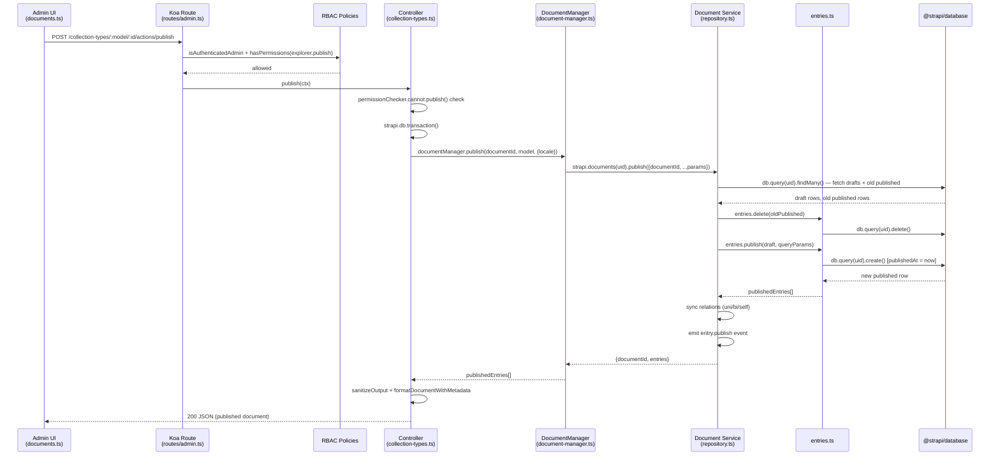

# End-to-End Trace: Publishing a Document

> Feature: clicking the **Publish** button in the Content Manager admin UI for a
> collection-type document.
> Every claim cites a file that was actually opened. Uncertain items are marked **UNVERIFIED:**.

---

## Numbered Call Chain

### Step 1 — Admin UI: `publishDocument` mutation
**File:** `packages/core/content-manager/admin/src/services/documents.ts` · lines 363–399

The RTK-Query mutation `publishDocument` fires a `POST` request.
For a collection-type with a known `documentId` it targets:
```
POST /content-manager/collection-types/:model/:id/actions/publish
```
For a new (not-yet-saved) document it omits the `:id` segment. The request body carries
any pending field changes (`data`) and optional query params (locale, populate).
After the server responds it invalidates the `Document`, `Relations`,
`RecentDocumentList`, and `CountDocuments` RTK-Query cache tags, causing the UI to
re-fetch and display the published state.

---

### Step 2 — Route definition
**File:** `packages/core/content-manager/server/src/routes/admin.ts` · lines 335–349 (with-id variant) / 320–334 (without-id)

Two `POST` route entries map to the same handler `collection-types.publish`.
Both are protected by two policies applied in order:
1. `admin::isAuthenticatedAdmin` — confirms a valid admin session.
2. `plugin::content-manager.hasPermissions` with
   `actions: ['plugin::content-manager.explorer.publish']` — checks the RBAC
   action for publishing within the Content Manager explorer.

Single types follow an identical pattern via `single-types.publish` at
`/single-types/:model/actions/publish` (same file, lines 157–165).

---

### Step 3 — Controller: `publish` action
**File:** `packages/core/content-manager/server/src/controllers/collection-types.ts` · lines 643–736

`async publish(ctx)` is the Koa route handler. It:
1. Reads `id` and `model` from `ctx.params`.
2. Calls `permissionChecker.cannot.publish()` and returns `ctx.forbidden()` if the
   user lacks field-level publish permission (a second, finer-grained check beyond the
   route policy).
3. Opens a `strapi.db.transaction(...)` wrapping the whole operation.
4. Decides whether this is a **create** (no `id`) or **update** (existing `id`) and
   delegates document creation/update before calling publish.
5. Calls `documentManager.publish(document.documentId, model, { locale })` — the
   handoff to the Content Manager's document-manager service.
6. Sanitizes the result through `permissionChecker.sanitizeOutput` (strips fields the
   user cannot read) and formats it with metadata before writing to `ctx.body`.

---

### Step 4 — Content-Manager Service: `document-manager.publish`
**File:** `packages/core/content-manager/server/src/services/document-manager.ts` · lines 168–180

A thin adapter method. It:
1. Builds a deep populate config (all relations, components, DZs) if none was supplied.
2. Calls `strapi.documents(uid).publish({ documentId: id, ...params })` — delegating to
   the framework-level Document Service.
3. Returns `result?.entries` (the array of newly published entries) to the controller.

This layer's job is to bridge the Content Manager plugin's conventions into the generic
Document Service API.

---

### Step 5 — Document Service: `repository.publish`
**File:** `packages/core/core/src/services/document-service/repository.ts` · lines 568–656

The core `publish` function (exposed on the repository, wrapped in a DB transaction via
`wrapInTransaction` at line 774). It:
1. Runs params through a pipeline: `validateParams` → `i18n.defaultLocale` →
   `i18n.multiLocaleToLookup` — normalising locale and building the SQL `WHERE` lookup.
2. **Parallel DB reads** via `strapi.db.query(uid).findMany(...)`:
   - Fetches all **draft** rows for this `documentId` (those with `publishedAt: null`).
   - Fetches all **old published** rows for this `documentId` (those where
     `publishedAt` is not null).
3. Loads unidirectional, bidirectional, and self-referential relation metadata so they
   can be re-wired after the swap.
4. **Deletes old published rows** — `entries.delete(entry.id)` for each.
5. Sets `firstPublishedAt` on each draft if it has never been published before.
6. **Creates new published rows** — calls `entries.publish(draft, queryParams)` for
   each draft entry (see Step 6).
7. **Re-syncs all relation types** so foreign keys point at the new published row IDs.
8. Emits `entry.publish` event on the `eventHub` for each newly published entry (line 653).
9. Returns `{ documentId, entries: publishedEntries }`.

---

### Step 6 — Document Service: `entries.publishEntry` → DB handoff
**File:** `packages/core/core/src/services/document-service/entries.ts` · lines 152–171

`publishEntry(entry, params)` is the function that writes the new published row.
It pipes the draft entry through:
1. `omit('id')` — strips the draft DB primary key so a new row is created.
2. `assoc('publishedAt', new Date())` — sets the publication timestamp, which is the
   field that distinguishes a published row from a draft row in the database.
3. `transformData(draft, { status: 'published', ... })` — normalises relation IDs from
   document IDs to DB-level entity IDs (the ID-map transform layer).
4. `createEntry({ ...params, data: draft, status: 'published' })` — calls the internal
   `createEntry` function, which validates, handles component rows, and issues
   `strapi.db.query(uid).create(...)` (line 108).

**This `strapi.db.query(uid).create(...)` call is the handoff to `@strapi/database`.**
Everything below this point is the Knex-based query builder — outside our scope.

---

## Mermaid Sequence Diagram



---

## Where Would I Change X?

### Add validation before publish (e.g. required fields must be non-null)
**File:** `packages/core/content-manager/server/src/controllers/collection-types.ts` · inside the `publish` action, before the `documentManager.publish(...)` call (line 721).

Add your check after the document is fetched (`document = await documentManager.findOne(...)`) 
and before `documentManager.publish(...)`. You have the full document in memory at that
point. Alternatively, hook into the `strapi::content-types.beforeSync` hook or the
`entry.publish` event in `repository.ts` for cross-cutting concerns.

### Run custom logic after publish (e.g. send a notification, invalidate a CDN cache)
**File:** `packages/core/core/src/services/document-service/repository.ts` · line 653.

The `entry.publish` event is emitted here via `publishedEntries.forEach(emitEvent('entry.publish'))`.
Subscribe to it in your plugin or `src/index.ts` bootstrap:
```ts
strapi.eventHub.on('entry.publish', ({ model, entry }) => { /* your logic */ });
```
No core files need to be modified.

### Change the publish permission check
The route-level RBAC action is declared in
`packages/core/content-manager/server/src/routes/admin.ts` line 330:
```ts
config: { actions: ['plugin::content-manager.explorer.publish'] }
```
Change the action string here (and register the new action in your permission provider)
to swap out the route gate. The fine-grained field-level check lives in
`packages/core/content-manager/server/src/controllers/collection-types.ts` line 652
(`permissionChecker.cannot.publish()`), which reads from the `@strapi/permissions` RBAC
engine — adjust the permission registration there to change what "can publish" means.

---

## Time Saved

A new developer manually grepping through a ~4,000-file monorepo for the publish call
chain would typically take **4–8 hours**; reading this document takes **10–15 minutes**.
