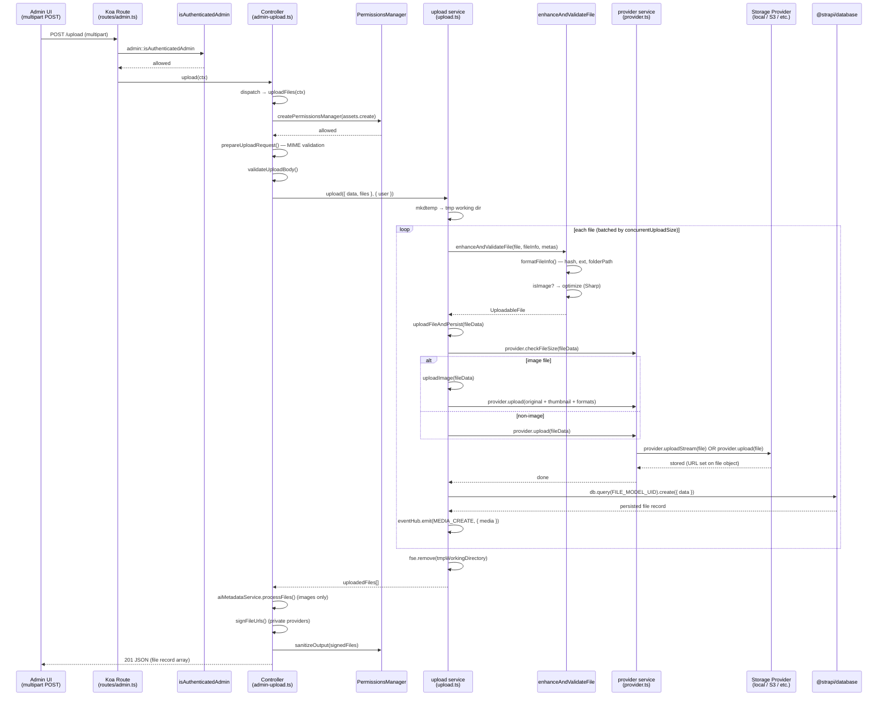

# End-to-End Trace: Uploading a File via the Media Library

> Feature: clicking **Add new assets** / dragging a file into the Media Library upload dialog
> in the Strapi admin UI and confirming the upload.
> Every claim cites a file that was actually opened. Uncertain items are marked **UNVERIFIED:**.

---

## Numbered Call Chain

### Step 1 — Route definition
**File:** `target/strapi/packages/core/upload/server/src/routes/admin.ts` · lines 40–46

The `POST /` admin route maps directly to the handler `admin-upload.upload`:

```ts
{
  method: 'POST',
  path: '/',
  handler: 'admin-upload.upload',
  config: {
    policies: ['admin::isAuthenticatedAdmin'],
  },
},
```

Only one policy gate is applied — `admin::isAuthenticatedAdmin` confirms a valid admin
session. Unlike most routes in this file, no `hasPermissions` action check is declared at
the route level; the RBAC check is performed inside the controller via a `PermissionsManager`
instance (**UNVERIFIED:** whether a separate `plugin::upload.assets.create` route-level check
exists in a custom policy not shown here).

---

### Step 2 — Controller entry point: `upload`
**File:** `target/strapi/packages/core/upload/server/src/controllers/admin-upload.ts` · lines 493–508

`upload(ctx)` is the thin dispatcher that routes the request to the correct sub-handler:

```ts
async upload(ctx: Context) {
  const {
    query: { id },
    request: { files: { files } = {} },
  } = ctx;

  if (_.isEmpty(files) || (!Array.isArray(files) && files.size === 0)) {
    if (id) {
      return this.updateFileInfo(ctx);    // no file, only metadata update
    }
    throw new errors.ApplicationError('Files are empty');
  }

  await (id ? this.replaceFile : this.uploadFiles)(ctx);
}
```

| Condition | Branch taken |
|---|---|
| No file, `?id` present | `updateFileInfo` — metadata-only update |
| File present, `?id` present | `replaceFile` — swap file binary for existing record |
| File present, no `?id` | `uploadFiles` — **new upload path (this trace)** |

---

### Step 3 — Controller: `uploadFiles`
**File:** `target/strapi/packages/core/upload/server/src/controllers/admin-upload.ts` · lines 163–235

`uploadFiles(ctx)` is the handler for a fresh upload. It:

1. Pulls `userAbility`, `user`, request `body`, and multipart `files` from the Koa context
   (lines 164–167).
2. Creates a `PermissionsManager` for `plugin::upload.assets.create` action and returns
   `ctx.forbidden()` if the user lacks that action (lines 170–178).
3. Calls `prepareUploadRequest(files, body, strapi)` (line 184) — validates MIME types and
   strips disallowed file types, returning `{ validFiles, filteredBody, errors }`.
4. Validates the request body schema via `validateUploadBody(filteredBody, isMultipleFiles)`
   (line 190).
5. Optionally reorders `filesArray` to match the order of `data.fileInfo` entries by
   `originalFilename` (lines 194–207).
6. **Calls `uploadService.upload({ data, files: filesArray }, { user })`** (line 210) — the
   handoff to the upload service.
7. After the upload, optionally triggers AI metadata generation for images via
   `aiMetadataService.processFiles` / `updateFilesWithAIMetadata` (lines 218–228).
8. Signs file URLs for private providers via `getService('file').signFileUrls` (line 231).
9. Sanitizes output through `pm.sanitizeOutput` and writes `ctx.body` with status `201`
   (lines 233–234).

---

### Step 4 — Upload service: `upload`
**File:** `target/strapi/packages/core/upload/server/src/services/upload.ts` · lines 244–292

`upload({ data, files }, opts)` orchestrates the full upload pipeline:

1. Creates a temporary working directory (`os.tmpdir()/strapi-upload-XXXX`) and assigns it
   to every file object (lines 256, 75–89).
2. Flattens `files` and `fileInfo` into arrays and zips them into `(file, fileInfo)` pairs
   (lines 262–264, 275–278).
3. Reads `concurrentUploadSize` from the plugin config (default `1`) and chunks the file
   pairs into batches of that size (lines 270–278).
4. For each batch, calls `Promise.all(batch.map(doUpload))` in parallel (lines 280–284).
5. `doUpload` for each file calls, in sequence:
   - `enhanceAndValidateFile(file, fileInfo, metas)` (line 266) — see Step 5.
   - `uploadFileAndPersist(fileData, { user })` (line 267) — see Step 6.
6. Cleans up the temporary directory in a `finally` block (line 288).
7. Returns the array of persisted file records (line 291).

---

### Step 5 — Upload service: `enhanceAndValidateFile` → `formatFileInfo`
**File:** `target/strapi/packages/core/upload/server/src/services/upload.ts` · lines 198–242 (`enhanceAndValidateFile`), lines 131–196 (`formatFileInfo`)

`enhanceAndValidateFile` normalises each raw multipart file before storage:

1. Resolves the effective MIME type — prefers a security-validated `detectedMimeType`
   (set by `prepareUploadRequest`), falls back to `file.mimetype`, then
   `application/octet-stream` (lines 205–210).
2. Calls `formatFileInfo({ filename, type, size }, fileInfo, metas)` (line 212).
   `formatFileInfo` builds the full entity object:
   - Sanitises filename (rejects `<>:"/\\|?*` and control characters).
   - Derives `ext` from the filename or MIME type.
   - Generates a unique `hash` via `imageManipulationService.generateFileName(basename)`.
   - Resolves `folderPath` from `fileInfo.folder` via `fileService.getFolderPath`.
   - Optionally attaches `related` (relation to a content-type field) from `metas`.
3. Attaches `filepath` and a `getStream` factory (`() => fs.createReadStream(file.filepath)`)
   so the provider can stream the file (lines 225–226).
4. For images: runs `isFaultyImage` check, then `optimize` (Sharp compression/conversion)
   if the image is optimisable (lines 232–239). Non-image files pass through unchanged.
5. Returns a fully-populated `UploadableFile`.

---

### Step 6 — Upload service: `uploadFileAndPersist`
**File:** `target/strapi/packages/core/upload/server/src/services/upload.ts` · lines 424–442

`uploadFileAndPersist(fileData, opts)` is the bridge between in-memory preparation and
durable storage:

1. Calls `getService('provider').checkFileSize(fileData)` (line 430) — enforces the
   `sizeLimit` from plugin config; throws if exceeded.
2. Branches on file type (lines 432–436):
   - **Image:** calls `uploadImage(fileData)` which also generates and uploads a thumbnail
     and responsive formats (all via `getService('provider').upload(...)`).
   - **Non-image:** calls `getService('provider').upload(fileData)` directly.
3. Sets `fileData.provider = config.provider` (line 438).
4. Calls `add(fileData, { user })` to persist the record to the database (line 441) — see
   Step 8.

---

### Step 7 — Provider service: `provider.upload` — the storage handoff
**File:** `target/strapi/packages/core/upload/server/src/services/provider.ts` · lines 13–33

`upload(file)` is the final handoff to the configured storage provider (local disk, S3, Cloudinary, etc.):

```ts
async upload(file: UploadableFile) {
  if (isFunction(strapi.plugin('upload').provider.uploadStream)) {
    file.stream = file.getStream();
    await strapi.plugin('upload').provider.uploadStream(file);
    delete file.stream;
    // ...
  } else {
    file.buffer = await fileUtils.streamToBuffer(file.getStream());
    await strapi.plugin('upload').provider.upload(file);
    delete file.buffer;
    // ...
  }
}
```

The service prefers the **streaming path** (`provider.uploadStream`) when the underlying
provider implements it — no full file buffer is held in memory. If the provider only
implements the legacy `upload` method, the entire file is first buffered via
`streamToBuffer`, then handed to `provider.upload(file)`.

After either path completes, the temporary `stream` / `buffer` property is deleted from the
file object to avoid holding large in-memory objects.

**`strapi.plugin('upload').provider.uploadStream(file)` (or `.upload(file)`) is the final
boundary** — everything below this call is the registered storage provider package
(e.g. `@strapi/provider-upload-local`, `@strapi/provider-upload-aws-s3`).

---

### Step 8 — Upload service: `add` → DB persist
**File:** `target/strapi/packages/core/upload/server/src/services/upload.ts` · lines 575–593

`add(values, opts)` persists the file record to the database:

1. Attaches `updatedBy` / `createdBy` from `user` if present (lines 579–584).
2. Emits `sendMediaMetrics` if the file has `caption` or `alternativeText` (line 586).
3. Calls `strapi.db.query(FILE_MODEL_UID).create({ data: fileValues })` (line 588) —
   **the DB write**. `FILE_MODEL_UID` is `plugin::upload.file`.
4. Emits the `MEDIA_CREATE` event on `strapi.eventHub` via `emitEvent` (line 590).
   Listeners receive `{ media: sanitizedFileData }`.
5. Returns the created DB record.

---

## Mermaid Sequence Diagram



---

## Where Would I Change X?

### Reject a specific file type before upload (e.g. block `.exe` files)
**File:** `target/strapi/packages/core/upload/server/src/utils/mime-validation.ts`
(called as `prepareUploadRequest` at
`target/strapi/packages/core/upload/server/src/controllers/admin-upload.ts` line 184).

`prepareUploadRequest` already filters files and returns `{ validFiles, errors }`. Add a
custom check here — or, if you don't want to modify core, add a lifecycle hook on
`plugin::upload.file` `beforeCreate` in your `src/index.ts`:
```ts
strapi.db.lifecycles.subscribe({
  models: ['plugin::upload.file'],
  beforeCreate({ params }) {
    if (params.data.ext === '.exe') throw new Error('Executables are not allowed');
  },
});
```

### Enforce a maximum file size different from the global `sizeLimit`
**File:** `target/strapi/packages/core/upload/server/src/services/provider.ts` · lines 8–11.

`checkFileSize` reads `sizeLimit` from `strapi.config.get('plugin::upload')`. Override
`plugin::upload.sizeLimit` in `config/plugins.ts`:
```ts
upload: { config: { sizeLimit: 10 * 1024 * 1024 } } // 10 MB
```
Or intercept in `enhanceAndValidateFile` (upload.ts line 198) to apply per-folder or
per-content-type rules before the provider check runs.

### Run custom logic after a file is uploaded (e.g. notify a webhook, index in search)
**File:** `target/strapi/packages/core/upload/server/src/services/upload.ts` · line 590.

The `MEDIA_CREATE` event (`media.create`) is emitted here via:
```ts
strapi.eventHub.emit(event, { media: sanitizedData });
```
Subscribe in your plugin or `src/index.ts` bootstrap:
```ts
strapi.eventHub.on('media.create', ({ media }) => { /* your logic */ });
```
No core files need to be modified. The same pattern works for `media.update` and
`media.delete`.

---

## Time Saved

A new developer manually tracing through a ~4,000-file monorepo for the upload call chain
would typically take **3–6 hours**; reading this document takes **10–15 minutes**.
